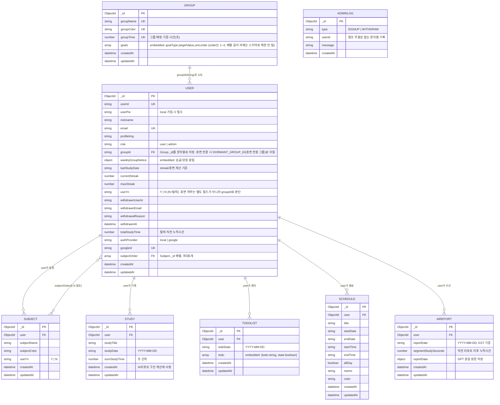

# Mollip ERD

MongoDB(Mongoose) 기반 스키마 구조입니다. 총 8개 컬렉션으로 구성되어 있습니다.

## 다이어그램

---

## 컬렉션별 요약

### GROUP
| 필드 | 타입 | 설명 |
|---|---|---|
| `_id` | ObjectId | PK |
| `groupName` | String | 고유, 그룹명 |
| `groupColor` | String | 고유, 그룹 대표 색상 |
| `groupTime` | Number | 고유, 그룹 배정 기준 시간(초) |
| `goals` | Array | 임베디드, 목표(`goalType`, `targetValue`, `unit`, `order`). `order`는 1~4 범위만 검증, 배열 길이 제한은 스키마에 없음 |
| `createdAt` / `updatedAt` | Date | `timestamps: true`로 자동 생성 |

### USER
| 필드 | 타입 | 설명 |
|---|---|---|
| `_id` | ObjectId | PK |
| `userId` | String | 고유, 로그인 아이디 |
| `userPw` | String | local 가입 시 필수 |
| `nickname` / `email` | String | 이메일 고유 |
| `role` | String | `user` \| `admin` |
| `groupId` | String | Group._id 참조 (약한 참조, ObjectId 아님). 휴면 전환 시 `DORMANT_GROUP_ID`(휴면 전용 그룹)로 재배정 — 휴면 여부는 별도 필드가 아니라 이 값으로 판단 |
| `weeklyGroupNotice` | Object | 임베디드, 승급/강등 알림 |
| `lastStudyDate` | String | streak·휴면 판정 기준 |
| `currentStreak` / `maxStreak` | Number | 연속학습일 |
| `useYn` | String | `Y` \| `N` (`N` = 탈퇴) |
| `withdrawn*` | - | 탈퇴 시 보관용 필드 |
| `authProvider` | String | `local` \| `google` |
| `subjectOrder` | Array\<ObjectId\> | Subject 참조, 최대 5개 |
| `createdAt` / `updatedAt` | Date | `timestamps: true`로 자동 생성 |

### SUBJECT
| 필드 | 타입 | 설명 |
|---|---|---|
| `_id` | ObjectId | PK |
| `user` | ObjectId | User 참조 |
| `subjectName` / `subjectColor` | String | 과목명·색상 |
| `useYn` | String | `Y` \| `N` |
| `createdAt` / `updatedAt` | Date | `timestamps: true`로 자동 생성 |

### STUDY
| 필드 | 타입 | 설명 |
|---|---|---|
| `_id` | ObjectId | PK |
| `user` | ObjectId | User 참조 |
| `studyTitle` | String | 공부한 과목명 |
| `studyDate` | String | YYYY-MM-DD |
| `sumStudyTime` | Number | 초 단위 |
| `createdAt` | Date | AI 리포트 구간 계산 기준 |
| `updatedAt` | Date | `timestamps: true`로 자동 생성 |

### TODOLIST
| 필드 | 타입 | 설명 |
|---|---|---|
| `_id` | ObjectId | PK |
| `user` | ObjectId | User 참조 |
| `todoDate` | String | YYYY-MM-DD |
| `todo` | Array | 임베디드 `{todo, state}` 목록 |
| `createdAt` / `updatedAt` | Date | `timestamps: true`로 자동 생성 |

### SCHEDULE
| 필드 | 타입 | 설명 |
|---|---|---|
| `_id` | ObjectId | PK |
| `user` | ObjectId | User 참조 |
| `title` / `memo` / `color` | String | 일정 내용 |
| `startDate` / `endDate` / `startTime` / `endTime` | String | 일시 |
| `allDay` | Boolean | 종일 여부 |
| `createdAt` / `updatedAt` | Date | `timestamps: true`로 자동 생성 |

### AIREPORT
| 필드 | 타입 | 설명 |
|---|---|---|
| `_id` | ObjectId | PK |
| `user` | ObjectId | User 참조 |
| `reportDate` | String | KST 기준 YYYY-MM-DD |
| `segmentStudySeconds` | Number | 직전 리포트 이후 누적 공부시간 |
| `reportData` | Object | GPT 응답 원문 |
| `createdAt` / `updatedAt` | Date | `timestamps: true`로 자동 생성 |

### ADMINLOG
| 필드 | 타입 | 설명 |
|---|---|---|
| `_id` | ObjectId | PK |
| `type` | String | `SIGNUP` \| `WITHDRAW` |
| `userId` | String | 참조 무결성 없는 로그성 기록 |
| `message` | String | 로그 메시지 |
| `createdAt` | Date | `Date.now` 기본값 (timestamps 옵션 아님, `updatedAt` 없음) |

---

## 관계 설계 관련 참고

- **휴면(dormant) 상태 = 특수 그룹 배정**: User에는 "휴면 여부"를 나타내는 별도 필드가 없습니다. 대신 `assignDormantGroups`(`service/dormantGroupService.js`)가 30일 이상 미접속 회원의 `groupId`를 환경변수 `DORMANT_GROUP_ID`가 가리키는 휴면 전용 그룹으로 재배정하는 방식으로 휴면 상태를 표현합니다. 즉 `groupId === DORMANT_GROUP_ID`가 곧 "휴면 회원"이라는 의미이며, 일반 그룹 소속과 같은 필드를 공유합니다.
- **USER ↔ SUBJECT (N:M)**: 일반적인 소유 관계(`Subject.user`, 1:N)와 별개로, `User.subjectOrder` 배열이 과목의 **표시 순서**만 참조하는 추가 관계입니다.
- **TODOLIST**: Todo 항목을 별도 컬렉션으로 분리하지 않고, 하루 단위 문서 안에 배열로 임베딩했습니다.
- **ADMINLOG → USER**: `userId`는 참조 무결성이 없는 문자열입니다. 탈퇴한 회원의 로그도 유지해야 하는 요구사항 때문으로 보입니다.
